<div align="right">

<!-- ══════════════ HERO ══════════════ -->



<br/>


<a href="https://github.com/Prajithaa1Parani?tab=followers"></a>

</div>

<br/>

## 🧭 about me 

```console
prajithaa@github:~$ whoami
AI/ML Engineer — I build agents that work, pipelines that scale,
and systems that turn data into decisions.

prajithaa@github:~$ cat focus.txt
▸ Multi-agent systems & AI automation frameworks
▸ Production ML — from notebook to deployed service
▸ Cloud-native AI on GCP · AWS · Azure

prajithaa@github:~$ echo $STATUS
Currently shipping: production-ready AI agent systems 🚀
```

<br/>

## ⚙️ Tech Arsenal

<div align="center">

**AI / Machine Learning**


**Engineering & Backend**


**Cloud**


</div>

<br/>

## 🏆 Certifications

<div align="center">


<br/>


</div>

<br/>

## 📊 GitHub Analytics

<div align="center">


</div>

<br/>

## 🐍 Contribution Snake

<div align="center">

<picture>
  <source media="(prefers-color-scheme: dark)" srcset="https://raw.githubusercontent.com/Prajithaa1Parani/Prajithaa1Parani/output/github-contribution-grid-snake-dark.svg" />
  
</picture>

</div>

<br/>

## 🤝 Connect

<div align="center">

<a href="https://www.linkedin.com/in/prajithaa-parani/"></a>
<a href="mailto:prajithaa.sasikala@gmail.com"></a>

<br/><br/>

```python
fun_fact = "I teach machines to think so I can think about bigger things 🧠"
```


</div>
